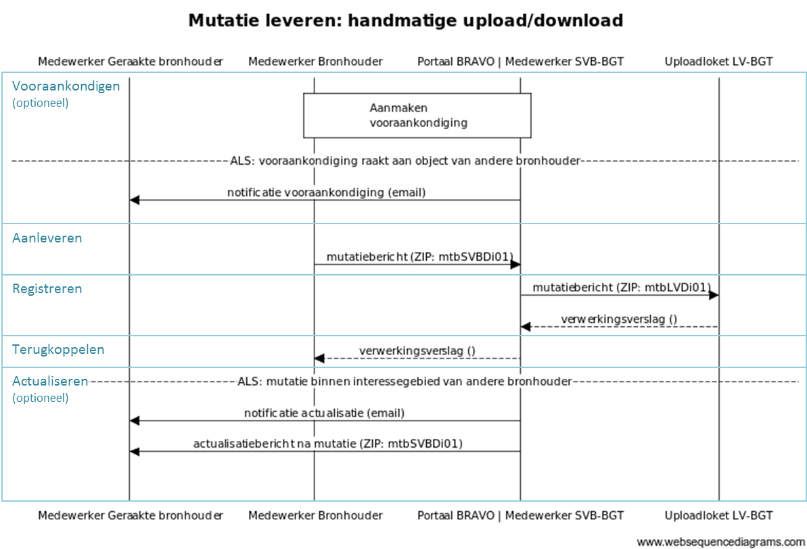
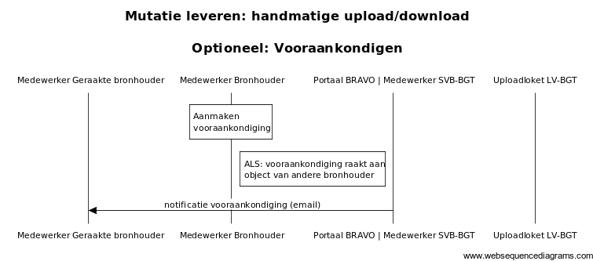
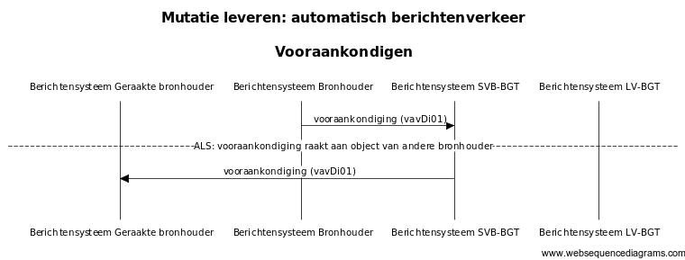
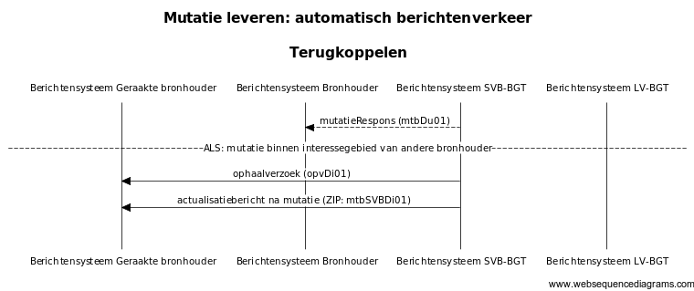
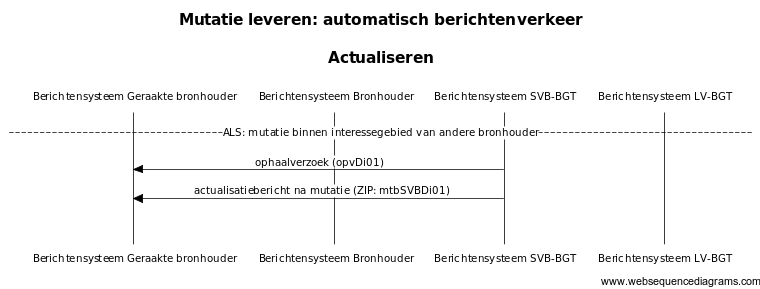

Scenario’s
==========

Dit hoofdstuk beschrijft het aanleveren en registreren van een mutatie en het
actualiseren van een bronhouder(s) indien een mutatie is doorgevoerd binnen het
interessegebied van een bronhouder(s).

Het scenario Mutaties bestaat uit de volgende deelprocessen:

1.  *Vooraankondigen:* een bronhouder doet een optionele aankondiging vooraf dat
    zij binnen een bepaald gebied mutaties gaat doorvoeren.

2.  *Aanleveren:* een bronhouder levert een mutatie ter registratie aan SVB-BGT.

3.  *Registreren:* SVB-BGT levert een mutatie van een bronhouder ter registratie
    door aan LV-BGT.

4.  *Terugkoppelen:* SVB-BGT koppelt het resultaat van verwerking terug aan een
    bronhouder.

5.  *Actualiseren:* een bronhouder actualiseert de eigen registratie met de
    registratie van SVB-BGT na een succesvol verwerkte mutatie binnen een
    bepaald interessegebied.

Handmatige upload/download
--------------------------

Het volledige proces van initieel leveren via handmatige upload/download is in
onderstaande sequentiediagram weergegeven.

### Aanleveren initieel

Medewerker Bronhouder maakt een levering aan in het Portaal BRAVO en uploadt één
of meer bestanden met de initiële levering naar het Portaal BRAVO. Medewerker
Bronhouder meldt een levering compleet, waarop de Medewerker SVB-BGT de levering
in het Portaal BRAVO oppakt.

### Controleren initieel

Medewerker SVB-BGT uploadt ieder bestand[^1] in een levering van een bronhouder
naar de controleservice in het Uploadloket LV-BGT. Het bestand wordt door de
controleservice van de LV-BGT gevalideerd. Na controle van ieder bestand
controleert de Medewerker SVB-BGT de status van verwerking en voegt het
verwerkingsverslag voor ieder bestand toe aan de levering in het Portaal BRAVO.

[^1]: Een bestand met initiële levering zijnde een ZIP-archief met daarin een
StUF-Geo IMGeo mutatiebericht (mtbSVB-BGTDi01) wordt ongewijzigd aangeboden aan
de LV-BGT.

Indien ieder bestand succesvol valideert tegen de controleservice, zal de
initiële levering voor verdere verwerking[^2] worden aangeboden.

[^2]: Alleen wanneer alle bestanden in een levering succesvol zijn gevalideerd,
zal de assemblage gestart worden.

Indien een bestand niet succesvol valideert tegen de controleservice, stopt de
verdere verwerking van de initiële levering en wordt het resultaat via het
Portaal BRAVO teruggekoppeld aan de bronhouder (zie 3.1.4 en 3.2.4).

### Assembleren

Tussen Controleren en Registreren zit de processtap Assembleren. Dit is een
intern proces in BRAVO waarbij de geometrieën van BGT-vlakobjecten[^3] op
maaiveldniveau in één of meer StUF-Geo IMGeo mutatieberichten in een levering
worden geassembleerd[^4] met elkaar en met al bestaande geometrieën van
BGT-vlakobjecten op maaiveldniveau in de productiedatabase van SVB-BGT.

[^3]: M.u.v. het BGT-objecttype Functioneel Gebied

[^4]: Assembleren is het zodanig wijzigen van geometrieën zodanig dat de
geometrieën naadloos op elkaar aansluiten.

Het resultaat van de assemblage is

-   voor elk door Bronhouder aangeleverd mutatiebericht, een nieuw StUF-Geo
    IMGeo mutatiebericht (mtbLVDi01) met de *geassembleerde initiële levering*
    dat in een ZIP-archief ter registratie aan LV-BGT aangeboden kan worden,

-   eventueel een StUF-Geo IMGeo mutatiebericht (mtbLVDi01) met een
    *voorbereidende mutatie* om een minimale geometrische aanpassing door te
    voeren in de registratie van LV-BGT,

-   één StUF-Geo IMGeo *actualisatiebericht na assemblage* (mtoDi01) voor alle
    bestanden in een levering. Dit actualisatiebericht bevat de geometrische
    wijzigingen[^5] als gevolg van de assemblage. Na de succesvolle verwerking
    van het geassembleerde bestand in de registratie van LV-BGT wordt dit
    actualisatiebericht aan de bronhouder(s) in de levering ter download
    aangeboden.

    [^5]: Indien er geen geometrische wijzigingen worden gemaakt, bevat het
    actualisatiebericht na assemblage geen kennisgevingen.

-   Een *assemblageverslag* met de verwerkingsdetails van validatie en
    assemblage.

Tijdens de assemblage zelf vindt er geen berichtenverkeer plaats tussen een
bronhouder en SVB-BGT, behalve als de assemblage mislukt: dan volgt een e-mail.

Na volledige aanlevering en assemblage van een gebied zullen de resterende
‘gaten’ in de kaart worden opgevuld met ongeclassificeerde objecten (OCO’s) door
BRAVO. Aan elk OCO wordt een standaard-bronhouder toegekend. De aangemaakte
OCO’s worden gebundeld in een *opvullevering*. Dit is een actualisatiebericht na
mutatie (mtbSVBDi01) met alleen één of meer toevoegingskennisgevingen van OCO’s.
Een opvullevering wordt beschikbaar gesteld aan elke bronhouder waarvan één of
meer OCO’s in de opvullevering geheel of gedeeltelijk overlapt met het
interessegebied van het abonnement voor actualisatieberichten van deze
bronhouder.

### Registreren initieel

Medewerker SVB-BGT uploadt ieder geassembleerd bestand voor initiële levering
naar de registratieservice via het Uploadloket LV-BGT. Ieder geassembleerde
bestand wordt door de registratieservice van LV-BGT gevalideerd. Na succesvolle
controle van een bestand worden de gegevens overgenomen in de LV-BGT.

Medewerker SVB-BGT controleert de status van verwerking en voegt het
verwerkingsverslag voor ieder geassembleerd bestand toe aan de levering in het
Portaal BRAVO.

Op het moment dat een geassembleerd bestand succesvol is geregistreerd in de
LV-BGT, wordt aan de objecten een LV-publicatiedatum door de LV-BGT toegekend en
opgenomen in het verwerkingsverslag.

### Terugkoppelen initieel

In deze stap wordt het resultaat van de initiële levering teruggekoppeld van
SVB-BGT naar de bronhouder. Medewerker Bronhouder ontvangt een e-mail met de
verwerkingsstatus van de levering, en kan vervolgens in het Portaal BRAVO elk
verwerkingsverslag downloaden.

### Actualiseren initieel

Na het succesvol registeren van een initiële levering van de bronhouder, worden
er door BRAVO één of meer actualisatieberichten beschikbaar gesteld:

-   Actualisatiebericht na assemblage (3.1.6.1)

-   Actualisatiebericht na mutatie met de initiële levering (3.1.6.2)

-   Actualisatiebericht na mutatie met de voorbereidende mutatie (3.1.6.3)

-   Actualisatiebericht na mutatie met de opvullevering (3.1.6.4)

#### 3.1.6.1 Actualisatiebericht na assemblage 

Na het succesvol registreren van de initiële levering, worden de wijzigingen uit
de assemblage door BRAVO beschikbaar gesteld aan elke bronhouder in de levering
in Portaal BRAVO. Elke Medewerker Bronhouder downloadt een actualisatiebericht
na assemblage (mtoDi01) in het Portaal BRAVO. De bronhouder verwerkt de gegevens
in het actualisatiebericht in de eigen applicatie.

#### 3.1.6.3 Actualisatiebericht na mutatie met voorbereidende mutatie

Indien een voorbereidende mutatie voorafgegaan is aan de registratie van de
initiële levering van een bronhouder, wordt aan elke bronhouder met een
abonnement op actualisatieberichten binnen het interessegebied waarmee de
voorbereidende mutatie geheel of gedeeltelijk overlapt, een actualisatiebericht
na mutatie met de voorbereidende mutatie beschikbaar gesteld. Het
actualisatiebericht na mutatie met voorbereidende mutatie wordt verstuurd voor
het actualisatiebericht na mutatie met initiële levering.

Het actualisatiebericht wordt uitgewisseld via handmatige upload/download of
automatisch berichtenverkeer conform 4.1.5 en 4.2.5

#### 3.1.6.2 Actualisatiebericht na mutatie met initiële levering

Na het succesvol registreren van de initiële levering, wordt voor elke
bronhouder met een abonnement op actualisatieberichten binnen het
interessegebied waarmee de initiële levering geheel of gedeeltelijk overlapt een
actualisatiebericht na mutatie met de initiële levering van Bronhouder
beschikbaar gesteld.

Het actualisatiebericht wordt uitgewisseld via handmatige upload/download of
automatisch berichtenverkeer conform 4.1.5 en 4.2.5

#### 3.1.6.4 Actualisatiebericht na mutatie met opvullevering

Na het succesvol registreren van een opvullevering, wordt voor elke bronhouder
met een abonnement op actualisatieberichten binnen het interessegebied waarmee
de opvullevering geheel of gedeeltelijk overlapt een actualisatiebericht na
mutatie met de opvullevering beschikbaar gesteld.

Het actualisatiebericht wordt uitgewisseld via handmatige upload/download of
automatisch berichtenverkeer conform 4.1.5 en 4.2.5.

Mutatie leveren
===============

Dit hoofdstuk beschrijft het aanleveren en registreren van een mutatie en het
actualiseren van een bronhouder(s) indien een mutatie is doorgevoerd binnen het
interessegebied van een bronhouder(s).

Het scenario Mutaties bestaat uit de volgende deelprocessen:

1.  *Vooraankondigen:* een bronhouder doet een optionele aankondiging vooraf dat
    zij binnen een bepaald gebied mutaties gaat doorvoeren.

2.  *Aanleveren:* een bronhouder levert een mutatie ter registratie aan SVB-BGT.

3.  *Registreren:* SVB-BGT levert een mutatie van een bronhouder ter registratie
    door aan LV-BGT.

4.  *Terugkoppelen:* SVB-BGT koppelt het resultaat van verwerking terug aan een
    bronhouder.

5.  *Actualiseren:* een bronhouder actualiseert de eigen registratie met de
    registratie van SVB-BGT na een succesvol verwerkte mutatie binnen een
    bepaald interessegebied.

Handmatige upload/download
--------------------------

Het volledige proces van mutatie leveren via handmatige upload/download is in
onderstaande sequentiediagram weergegeven.

### Vooraankondigen

Een vooraankondiging is een optionele processtap, die tot doel dient andere
bronhouders vooraf te informeren over een voorgenomen mutatie in een bepaald
gebied. Bronhouders kunnen zo rekening houden met (geplande) mutaties van andere
bronhouders bij het uitvoeren van de bijhouding en zondig hierover vooraf
afspraken maken.

Medewerker Bronhouder maakt in Portaal BRAVO een vooraankondiging aan. In een
online kaartviewer in het Portaal BRAVO tekent Medewerker Bronhouder een
geometrische contour en voert de begin- en einddatum van de vooraankondiging in.
Vervolgens bevestigt Medewerker Bronhouder de vooraankondiging in het Portaal
BRAVO, waarna de verwerking wordt gestart.

De geometrische contour en datums worden door Systeem BRAVO geregistreerd in de
eigen applicatie en er wordt gecontroleerd of de geometrische contour raakt aan
een object van andere bronhouder(s).

Indien wel rakend en de andere bronhouder(s) is/zijn *niet* aangesloten op
Systeem BRAVO via automatisch berichtenverkeer, wordt door BRAVO een e-mail
gestuurd met de gegevens van de vooraankondiging aan elke Medewerker Geraakte
bronhouder.

### Aanleveren mutatie

Medewerker Bronhouder maakt een levering aan in het Portaal BRAVO en uploadt één
bestand met mutaties naar het Portaal BRAVO. Medewerker Bronhouder meldt een
levering compleet, waarop de Medewerker SVB-BGT de levering in het Portaal BRAVO
oppakt.

### Registreren mutatie

Beheerder SVB-BGT biedt het bestand van een bronhouder in een levering ter
registratie aan het Uploadloket LV-BGT aan. Door de LV-BGT wordt het bestand
gecontroleerd en na succesvolle controle worden de gegevens overgenomen in de
registratie van de LV-BGT. Medewerker SVB-BGT controleert de status van
verwerking en voegt het verwerkingsverslag toe aan de levering in het Portaal
BRAVO. Medewerker SVB-BGT uploadt het verwerkingsverslag naar Portaal BRAVO bij
de betreffende levering.

Indien het bestand succesvol is geregistreerd in de LV-BGT, wordt door de LV-BGT
aan de objecten een LV-publicatiedatum toegekend en opgenomen in het
verwerkingsverslag.

Indien het bestand niet succesvol is geregistreerd, wordt het resultaat via
SVB-BGT teruggekoppeld aan de bronhouder en stopt de verdere verwerking van het
mutatiebericht.

### Terugkoppelen mutatie

Medewerker Bronhouder ontvangt een e-mail met de verwerkingsstatus van de
levering, en kan vervolgens in het Portaal BRAVO het verwerkingsverslag
downloaden.

### Actualiseren na mutatie

Na het succesvol registeren van een bestand met mutaties van een bronhouder,
wordt door BRAVO gecontroleerd of de geometrieën in het mutatiebericht
(mtbSVBDi01) geheel of gedeeltelijk overlappen met de geometrische contour van
het interessegebied[^6] van andere bronhouder(s).

[^6]: Via een abonnementenfunctie in het Portaal BRAVO kan een bronhouder zich
abonneren op een geografisch afgebakend interessegebied. De geabonneerde
bronhouder krijgt dan mutaties die zich voordoen in dat gebied.

Indien wel rakend en de andere bronhouder(s) is/zijn *niet* aangesloten op
Systeem BRAVO via automatisch berichtenverkeer, ontvangt elke Medewerker
Geraakte bronhouder per e-mail een notificatie. Daarna kan Medewerker Geraakte
bronhouder een actualisatiebericht na mutatie (mtbSVBDi01) downloaden in het
Portaal BRAVO. Medewerker Geraakte bronhouder verwerkt vervolgens de gegevens
van het actualisatiebericht in de eigen applicatie.

Automatisch berichtenverkeer
----------------------------

Het volledige proces van mutatie leveren via automatisch berichtenverkeer is in
onderstaande sequentiediagram weergegeven.

### Vooraankondigen mutatie

Door Berichtensysteem Bronhouder wordt een vooraankondigingsbericht (vavDi01)
gestuurd aan Berichtensysteem BRAVO met een geometrische contour van het gebied,
de begin- en einddatum en de bronhouder van de vooraankondiging.

De geometrische contour en datums worden door Berichtensysteem BRAVO
geregistreerd in de eigen applicatie en er wordt gecontroleerd of de
geometrische contour raakt aan een object van andere bronhouder(s).

Indien rakend en de andere bronhouder(s) is/zijn aangesloten op Berichtensysteem
BRAVO via automatisch berichtenverkeer, dan wordt het vooraankondigingsbericht
(vavDi01) met dezelfde functionele inhoud maar met gewijzigde logistieke
gegevens doorgezonden naar elk Berichtensysteem Geraakte bronhouder.

### Aanleveren mutatie

Door Berichtensysteem Bronhouder wordt een ophaalVerzoek (opvDi01) gestuurd aan
Berichtensysteem BRAVO voor het ophalen van een bestand met mutaties. Het
bestand wordt opgehaald door Berichtensysteem BRAVO en de verwerking wordt
gestart.

### Registreren mutatie

Door Berichtensysteem BRAVO wordt een ophaalVerzoek (opvDi01) gestuurd aan
Berichtensysteem LV-BGT voor het ophalen van een bestand ter registratie. Het
bestand wordt opgehaald door Berichtensysteem LV-BGT en de verwerking wordt
gestart.

Door Berichtensysteem LV-BGT wordt het bestand gecontroleerd en na succesvolle
controle worden de gegevens overgenomen in de LV-BGT.

Door Berichtensysteem LV-BGT wordt een mutatieRespons (mtbDu01) gestuurd aan
Berichtensysteem BRAVO met de status van verwerking en een URL naar het
verwerkingsverslag. Door Berichtensysteem BRAVO wordt de URL van het
verwerkingsverslag toegevoegd aan de levering.

Indien de gegevens in het bestand succesvol zijn geregistreerd in LV-BGT, wordt
door de LV-BGT aan de objecten een LV-publicatiedatum toegekend en opgenomen in
het verwerkingsverslag en het bericht mutatieRepons (mtbDu01).

Indien de gegevens in het bestand niet succesvol zijn geregistreerd, wordt het
resultaat door Berichtensysteem SVB-BGT teruggekoppeld aan een bronhouder (zie
4.2.4) en stopt de verdere verwerking van het mutatiebericht.

### Terugkoppelen mutatie

Door Berichtensysteem BRAVO wordt een mutatieRepons (mtbDu01) gestuurd aan
Berichtensysteem Bronhouder met de status van verwerking en een URL naar het
verwerkingsverslag.

### Actualiseren

Na het succesvol registeren van een bestand met mutaties van een bronhouder
wordt door Berichtensysteem BRAVO gecontroleerd of de geometrieën in het bestand
geheel of gedeeltelijk overlappen met de geometrische contour van het
interessegebied van andere bronhouder(s).

Indien rakend en de andere bronhouder(s) is/zijn aangesloten op Berichtensysteem
BRAVO via automatisch berichtenverkeer, dan wordt door Berichtensysteem BRAVO
een ophaalVerzoek (opvDi01) gestuurd aan de systemen van andere bronhouder(s)
voor het ophalen van actualisatiebericht na mutatie (mtbSVBDi01)[^7].

[^7]: Dit is hetzelfde bestand met mutaties dat Bronhouder ter registratie heeft
aangeleverd. De logistieke gegevens in de \<StUF:stuurgegevens\> worden niet
gewijzigd in het mutatiebericht van Bronhouder zodat de andere bronhouder(s) de
herkomst van de mutatie te kunnen herleiden.

