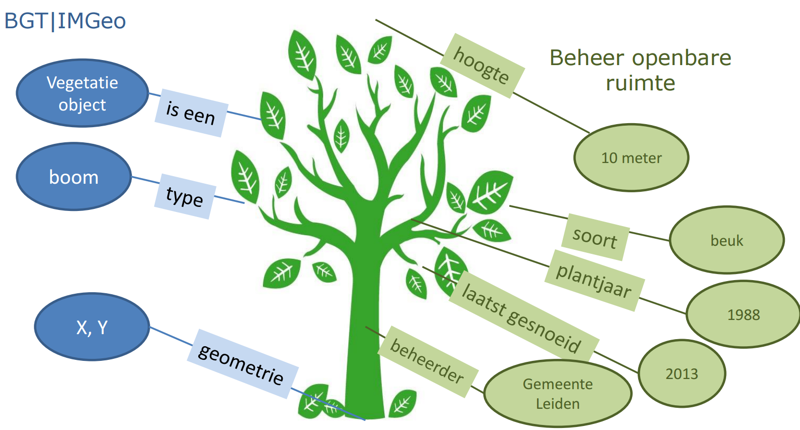

Inleiding
=========

Het Informatiemodel Beheer Openbare Ruimte (IMBOR) 2020 sluit aan op de
bestaande versie van IMGeo, 2.1.1. In IMGeo 2.1.1 ontbreken bepaalde
subclassificaties van objecten die wel in IMBOR voorkomen. Om
IMBOR-classificaties zonder gegevensverlies te kunnen uitwisselen tussen Geo- en
BOR-afdeling binnen een organisatie middels het StUF-Geo BOR berichtenverkeer
kan de werkafspraak ‘Uitbreiding domeinwaarden en attributen’ worden toegepast.

Deze werkafspraak beschrijft hoe met het mechanisme van
StUF:aanvullendeElementen extra attributen en domeinwaarden aan IMGeo-objecten
kunnen worden toegevoegd in de uitwisseling. Bijvoorbeeld bij een Wegdeel kan
naast de IMGeo-classificaties ‘gesloten verharding’ en ‘asfalt’ het soort asfalt
(bijv. ZOAB) of datum van laatste onderhoud uit de BOR-registratie worden
opgenomen. Of bij een VegetatieObject van het type ‘boom’ kan het soort boom
(bijv. ‘beuk’) of het plantjaar worden opgenomen.

In de IMGeo catalogus paragraaf 1.4 staat beschreven dat het opnemen van een
nadere classificatie van een objecttype optioneel is. Zo kan men ervoor kiezen
alle borden op te nemen, maar niet nader te classificeren om wat voor soort bord
het gaat. Deze objecten mogen zonder IMGeo-classificaties worden uitgewisseld
met de LV-BGT.

Dit betekent voor de uitwisseling van IMBOR-classificaties middels het Geo-BOR
berichtenverkeer dat de IMGeo-classificaties leeg mogen zijn, als er geen
passende IMGeo-classificatie is voor een IMBOR-classificatie. Dit geldt onder
meer voor een Paal van het BOR-type ‘vlaggenmast’, Straatmeubilair van het
BOR-type ‘informatiezuil’ of Kunstwerkdeel van het bor-type
‘groeiplaatsinrichting’.
