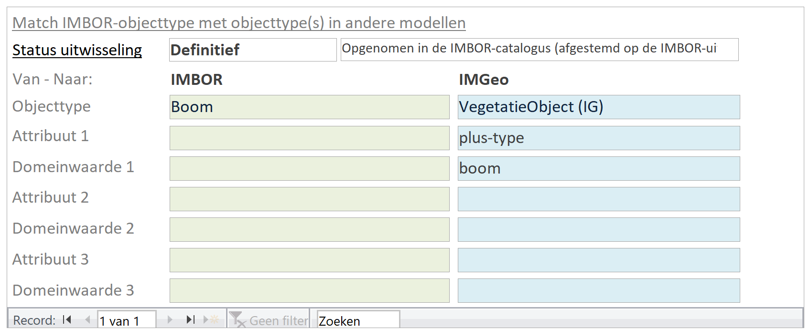
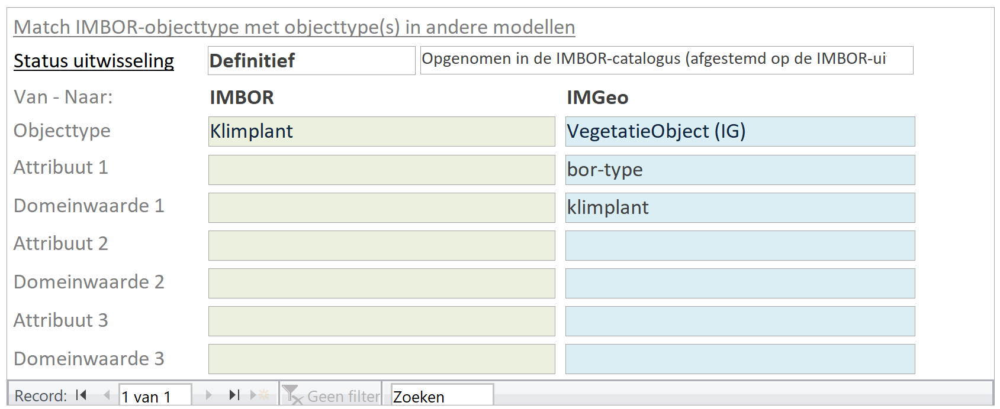
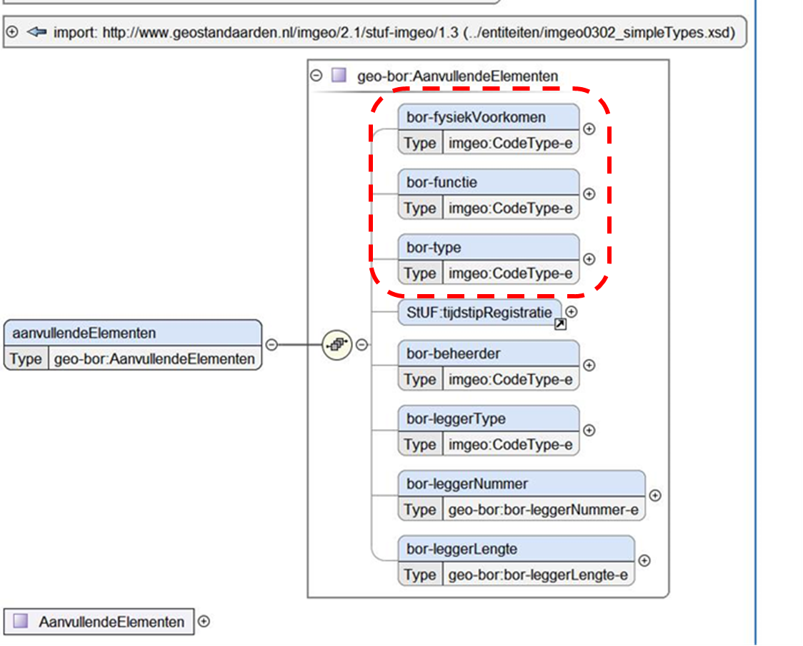

Toepassing
==========

Mapping van IMBOR op IMGeo
--------------------------

Het IMBOR wordt door CROW beheerd en gepubliceerd als Access-database. In deze
database is de uitwisseling met IMGeo 2.1.1 op objecttypeniveau te raadplegen in
het tabblad ‘Definities’ van het formulier ‘Objecttypes’. Zie hieronder voor
twee voorbeelden. Boom in IMBOR is te vertalen naar VegetatieObject van het type
boom in IMGeo 2.1.1, en klimplant is te vertalen naar VegetatieObject zonder
IMGeo-classificatie (‘klimplant’ is geen geldige type van VegetatieObject in
IMGeo 2.1.1).

Bij de vier vlakobjecten (Groenobject, Verhardingsobject, Terreindeel en
Waterobject) is de uitwisseling met IMGeo 2.1.1 complexer en zijn er meer regels
nodig voor het definiëren van de uitwisseling. Deze informatie is in het
formulier in een apart tabblad opgenomen. Hieronder het voorbeeld van het
tabblad Verhardingsobject.

Vanuit het hoofdmenu van IMBOR is de complete uitwisseling tussen IMBOR en IMGeo
2.1.1 raadpleegbaar. Deze uitwisseling is vastgelegd in de tabel
ObjecttypeRelaties.

Bij de werkafspraak ‘Uitbreiding domeinwaarden en attributen’ is een
berichtschema beschikbaar gesteld met een aantal extra attributen die voor de
meeste organisatie toereikend zullen zijn. Organisaties kunnen er voor kiezen om
dit berichtschema samen met hun leverancier aan te passen of uit te breiden naar
hun eigen behoefte.

Attributen
----------

Voor de uitwisseling van IMBOR-classificaties zijn echter de volgende attributen
afdoende:

-   _bor-fysiekVoorkomen_: voor het registreren en uitwisselen van fysiek
    voorkomens die wel in de openbare ruimte voorkomen, maar nog niet opgenomen
    zijn in IMGeo. Denk hier bijvoorbeeld aan: hout, metaal, basalt en
    kunststof. 

-   _bor-functie_: voor het registreren van extra functies. Op deze manier kunnen nu 
alle wegfuncties binnen IMBOR tussen de BOR-omgeving en de Geovoorziening uitgewisseld worden. 

-   _bor-type_: voor het registreren en uitwisselen van extra types.
Op deze manier kan de geometrie van ongeveer 200 IMBOR-objecttypes uitgewisseld
worden. 

In de bijlage zijn de IMBOR-classificaties voor bor-fysiekVoorkomen, bor-functie en bor-type opgenomen
    die binnen het Geo-BOR berichtenverkeer uitgewisseld kunnen worden.

Waardelijsten
-------------

In het StUF-Geo IMGeo berichtenverkeer wordt in de XML-elementen voor
fysiekVoorkomen, functie en bor-type verwezen naar een waardelijst (ookwel
codelist) in het XML-attribuut codeSpace. Bijvoorbeeld voor plus-functie van een
Wegdeel:

    <stuf-geo:plus-functie  
    codeSpace="http://www.geostandaarden.nl/imgeo/def/2.1#FunctieWegPlus">
    verkeersdrempel
    </stuf-geo:plus-functie>

Deze waardenlijsten zijn voor IMGeo in RDF-formaat beschikbaar in het [technisch
register van Geonovum](https://register.geostandaarden.nl/waardelijst/imgeo/).

Voor de aanvullende elementen van IMBOR-classificaties wordt hetzelfde principe
gehanteerd: in de XML-elementen van bor-fysiekVoorkomen, bor-functie, en
bor-type wordt verwezen naar de bijbehorende BOR-waardelijst in het attribuut,
bijvoorbeeld:

    <geo-bor:bor-functie  
    codeSpace="http://register.geostandaarden.nl/geobor/2020/id/waarde/FunctieWegBOR">
    woonstraat
    </geo-bor:bor-functie>

De waardenlijsten voor de IMBOR-classificaties die uitgewisseld kunnen worden in
de aanvullende elementen bor-fysiekvoorkomen, bor-functie en bor-type zijn
beschikbaar in het [technisch
register van Geonovum](https://register.geostandaarden.nl/waardelijst/geobor/).
