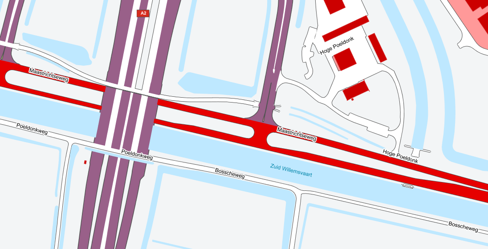
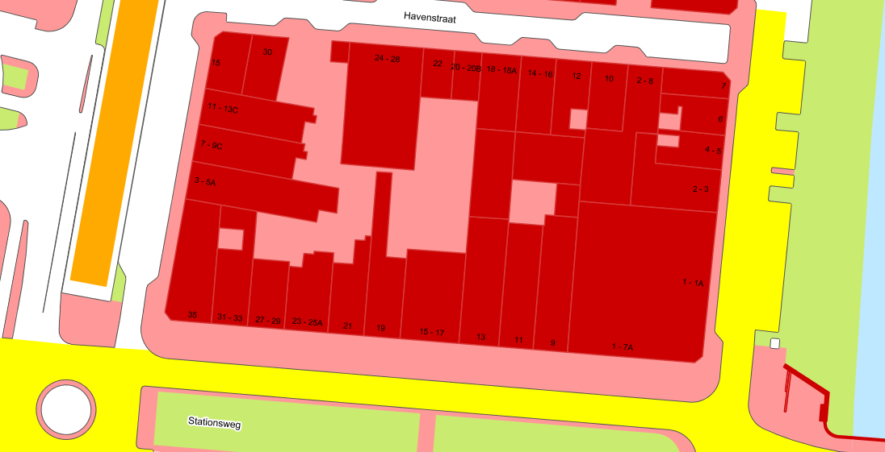

Kaartbeschrifting
=================

In de BGT worden teksten opgenomen en gevisualiseerd ten behoeve van de
oriëntatie. De teksten zijn opgenomen als individuele puntobjecten met als
attributen de naam die op de betreffende locatie afgebeeld dient te worden en de
rotatie, de hoek waaronder de tekst geplaatst dient te worden. Deze teksten
betreffen namen van openbare ruimten en nummeraanduidingsreeks bij panden. Voor
de teksten die betrekking hebben op openbare ruimten wordt ook het type openbare
ruimte vastgelegd.

In de standaardvisualisatie, pastelvisualisatie en de objectgerichte
visualisatie wordt gebruik gemaakt van het lettertype 'Arial'. In de
achtergrondvisualisatie wordt gebruik gemaakt van het lettertype
'RijksoverheidSansTextTT' en 'RijksoverheidSansHeadingTT'.

OpenbareRuimteLabel
-------------------

In de visualisatie van de BGT worden namen gepresenteerd van alle openbare
ruimten

zoals gedefinieerd in de BAG. Dit is bedoeld ter oriëntatie. Een naam van een
openbare

ruimte kan meerdere malen worden gepresenteerd.

De visualisatie van een openbare ruimtenaam vindt plaats door de coördinaten van
het midden (centrum) van de tekst vast te leggen, als mede de rotatie van de
tekst ten opzichte van de normale tekstrichting. De naam wordt geautomatiseerd
uit de BAG overgenomen.

Op basis van de attribuut “plus-type” wordt bepaald, of het attribuut “Rotatie”
wordt gebruikt voor de visualisatie. Alleen voor het visualiseren van objecten
met de domeinwaarde “Weg”, “Spoorbaan”, “Water” voor het attribuut “plus-type”
wordt het attribuut “Rotatie” meegenomen in de visualisatie. De domeinwaarden
voor het attribuut “Rotatie” liggen tussen de –90 graden en +90 graden.

De locaties van de puntobjecten worden ingewonnen op schaal 1:2000.

*Figuur: Straatnamen en waternamen gepresenteerd in de standaardvisualisatie.*

Nummeraanduidingreeks
---------------------

In de visualisatie van de BGT worden nummeraanduidingen gepresenteerd behorend
bij panden zoals gedefinieerd in de BAG voor de verblijfsobjecten in die panden.
Dit is bedoeld ter oriëntatie. De nummeraanduidingen van verblijfsobjecten in
een pand worden verzameld tot een nummeraanduidingreeks. Indien er slechts één
huisnummer voorkomt wordt alleen deze getoond. Bij meerdere huisnummers worden
het eerste en het laatste huisnummer getoond, gescheiden door een koppelteken,
bijvoorbeeld '33-39'. Indien in een reeks ook huisletters voorkomen dan worden
deze ook afgebeeld, bijvoorbeeld '33A-33Z' of '33A-39A'. Indien in een reeks ook
toevoegingen voorkomen dan worden deze niet afgebeeld. Indien in een pand één en
slechts één verblijfsobject voorkomt, dan wordt de nummeraanduiding hiervan
volledig weergegeven, dus zowel het huisnummer als de eventueel aanwezige
huisletter en/of de aanwezige toevoeging. Als een pand op de grens van twee of
meer openbare ruimten is gelegen en nummeraanduidingen daarbinnen bij meerdere
openbare ruimten horen, dan worden er meerdere (reeksen van) nummeraanduidingen
afgebeeld overeenkomstig bovenstaande regels.

*Figuur: Nummeraanduidingsreeks wordt geplaatst, waarbij de rotatie ten opzichte
van de normale tekstrichting minimaal is.*

De visualisatie van een nummeraanduidingreeks vindt plaats door de coördinaten
van het midden (centrum) van de tekst vast te leggen, alsmede de rotatie van de
tekst ten opzichte van de normale tekstrichting. De nummeraanduidingreeks dient
te worden geplaatst tegen de ‘straatzijde’ van het pand aan, met een minimale
hoek ten opzichte van de normale tekstrichting.

De locaties van de puntobjecten worden ingewonnen op schaal 1:1000.
