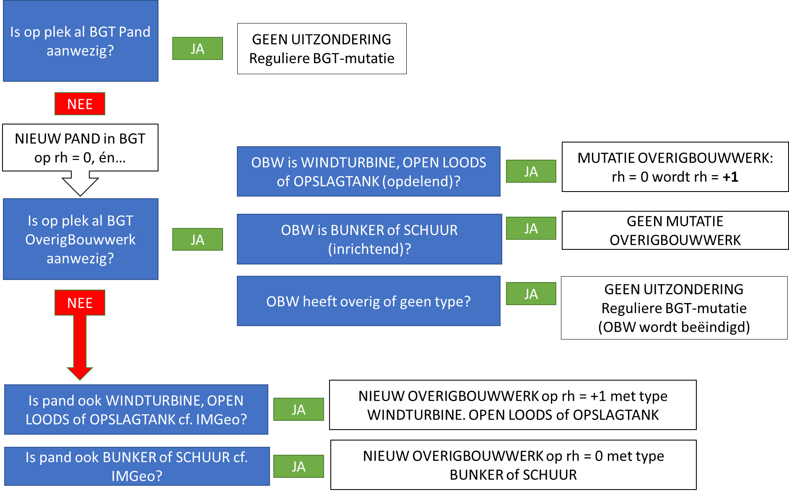

Bijlage: Werkinstructie
=======================

Deze bijlage geeft in meer detail de werkinstructies voor BGT bronhouder.

Scenario’s
----------

Aanleiding om deze werkinstructie er bij te pakken is dat BGT een mutatie op of
een nieuw pand vanuit BAG heeft ontvangen. Er worden drie scenario’s
onderscheiden:

1.  **Op de plek van het BAG-Pand is reeds een BGT Pand aanwezig** Voor de BGT
    is dit een reguliere mutatie: de gegevens van het BGT Pand worden bijgewerkt
    op basis van de gegevens van BAG.

2.  **Op de plek van het BAG-Pand is een OverigBouwwerk aanwezig** In dat geval
    neemt de BGT bronhouder een nieuw BGT Pand op, én indien het OverigBouwwerk
    van het type:

    1.  **Windturbine**, **open loods** of **opslagtank** wijzigt BGT bronhouder
        de relatieve hoogteligging van het OverigBouwwerk naar één hoger dan het
        nieuwe BGT Pand.

    2.  **Schuur** of **bunker** hoeft BGT bronhouder geen wijziging op dit
        OverigBouwwerk door te voeren.

    3.  **Niet ingevuld/leeg** beëindigd BGT bronhouder het OverigBouwwerk. De
        eventueel gekoppelde gegevens in de eigen omgeving aan het
        OverigBouwwerk worden gekoppeld aan het nieuwe Pand.

3.  **Op de plek van het BAG-Pand is geen Pand of OverigBouwwerk aanwezig** In
    In dat geval neemt de BGT bronhouder een nieuw Pand op, én een nieuw
    OverigBouwwerk conform de huidige regels van IMGeo, waarbij een
    OverigBouwwerk van type:

    1.  **Windturbine**, **open loods** of **opslagtank verplicht** wordt
        opgenomen op een relatieve hoogteligging één hoger dan het nieuwe Pand.

    2.  **Schuur** of **bunker optioneel** wordt opgenomen op dezelfde relatieve
        hoogteligging als het nieuwe Pand.

Beslisboom
----------

De drie scenario’s zijn uitgewerkt in onderstaande beslisboom.

Overzichttabel
--------------

In onderstaande overzichtstabel is per objecttype, aanleiding en doorwerking in
BAG beschreven hoe BGT bronhouder de gegevens in de BGT dient over te nemen.

