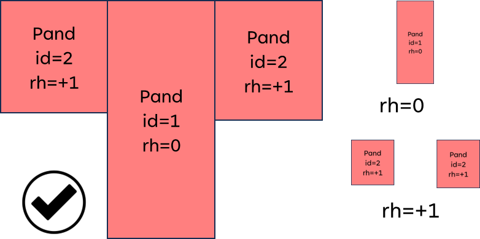

## Nadere toelichting en aanvullende eisen voor overbouw en onderbouw

### Waarom overbouw en onderbouw in de BGT?

Voor het in samenhang bijhouden van BAG en BGT geometrie is belangrijk om niet
alleen de grondvlakgeometrie, maar ook de uitstekende delen voor overbouw en
onderbouw te registreren. De overbouw en onderbouw moet nu nog apart
geregistreerd worden door bronhouder in het eigen systeem. Het opnemen van
overbouw en onderbouw in de BGT maakt het eenvoudiger voor

Informatie over overbouw en onderbouw is relevant voor diverse gebruikers. Door
het opnemen van overbouw en onderbouw in de BGT komt meer informatie voor
gebruikers beschikbaar dan in de BAG nu aanwezig is: in de BGT wordt expliciet
gemaakt of er sprake is van overbouw of onderbouw; BAG kent enkel de volledige
samengestelde contour van het bovenaanzicht.

Met de opname van overbouw en onderbouw in de BGT worden de eerste stappen
richting 3D gebouwinformatie gezet.

### Mogen, dus optioneel

De werkafspraak regelt dat bronhouders optioneel overbouw en onderbouw van een
pand mogen opnemen en registreren in de Landelijke Voorziening BGT. Er geldt dus
geen verplichting: bronhouders maken hun eigen afweging of het opnemen van
overbouw en onderbouw in hun BGT van toegevoegde waarde is.

### Uitstekende delen

Enkel de **uitstekende delen** van het pand ten opzicht van de
grondvlakgeometrie mogen worden opgenomen in een BGT Pand voor onderbouw en
onderbouw. Het is niet de bedoeling om een hele verdieping af te bakenen.

GOED: 1 BAG Pand is opgedeeld in 3 BGT panden:

-   1 object met grondvlakgeometrie op rel.hoogte 0

-   1 object voor onderbouw op rel.hoogte -1

-   1 object voor overbouw op rel.hoogte +1

FOUT: 1 BAG Pand is opgedeeld in 2 BGT panden:

-   Het object voor overbouw bevat niet enkel de uitstekende delen maar bevat
    ook de grondvlakgeometrie.

### Betreedbare delen

Enkel het **betreedbare deel** van overbouw of onderbouw dient als Pand te
worden afgebakend. Het niet -betreedbare deel kan optioneel als
Gebouw-installatie in IMGeo worden opgenomen, vergelijkbaar met een luifel.

### Per relatieve hoogte één object

Uitstekende delen op **dezelfde relatieve hoogte** worden in één BGT Pand-object
met *multivlak*geometrie opgenomen. Het is niet de bedoeling om elk afzonderlijk
deel op dezelfde relatieve hoogte in een apart BGT Pand object op te nemen.

GOED: 1 BAG Pand is opgedeeld in 3 BGT panden:

-   1 object met grondvlakgeometrie op rel.hoogte 0

-   1 object voor overbouw op rel. hoogte +1

-   1 object voor overbouw op rel. hoogte +2.

GOED: 1 BAG Pand is opgedeeld in 2 BGT panden:

-   1 object met grondvlakgeometrie op rel.hoogte 0

-   1 object met multivlakgeometrie voor overbouw op rel.hoogte +1

FOUT: 1 BAG Pand is opgedeeld in 3 BGT panden:

-   De objecten voor overbouw op gelijke relatieve hoogte worden opgenomen in
    één Pand-object met multivlakgeometrie.

### Topologie

De objecten voor overbouw en onderbouw moeten (weliswaar op andere relatieve
hoogte) **naadloos grenzen aan de grondvlakgeometrie** van het Pand. Overlap en
gaten tussen grondvlakgeometrie en overbouw/onderbouw is niet toegestaan.

FOUT: 1 BAG Pand is opgedeeld in 3 BGT Panden

-   De geometrie van het object voor overbouw overlapt met het object met
    grondvlakgeometrie.

-   De geometrie van object voor onderbouw grenst niet aan het object met
    grondvlakgeometrie.
